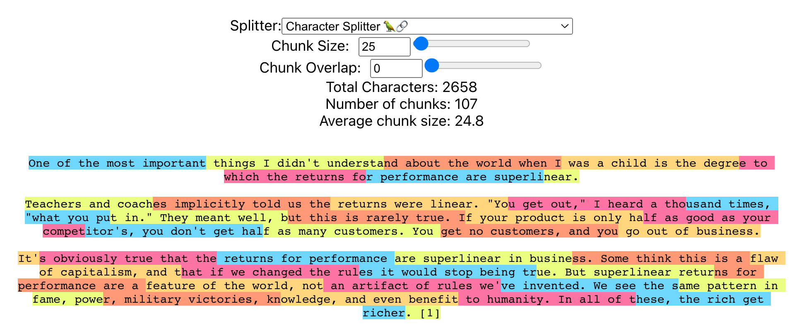

# Chunk Visualization

This is a tool to visualize how different text splitters chunk up text

## Installation and Running Instructions

Follow these steps to download and run the application on your local machine.

### Prerequisites

Before you begin, ensure you have [Node.js](https://nodejs.org/) installed on your system.

### Step 1: Clone the Repository

First, clone the repository to your local machine using the following command:
`git clone https://github.com/batterii/text-chunk-visual`

### Step 2: Install Dependencies

Navigate to the cloned repository's directory and install the necessary dependencies:

`cd text-chunk-visual`

`npm install`

### Step 3: Build the Application

`npm run build`

### Step 4: Run locally

`npm start`

